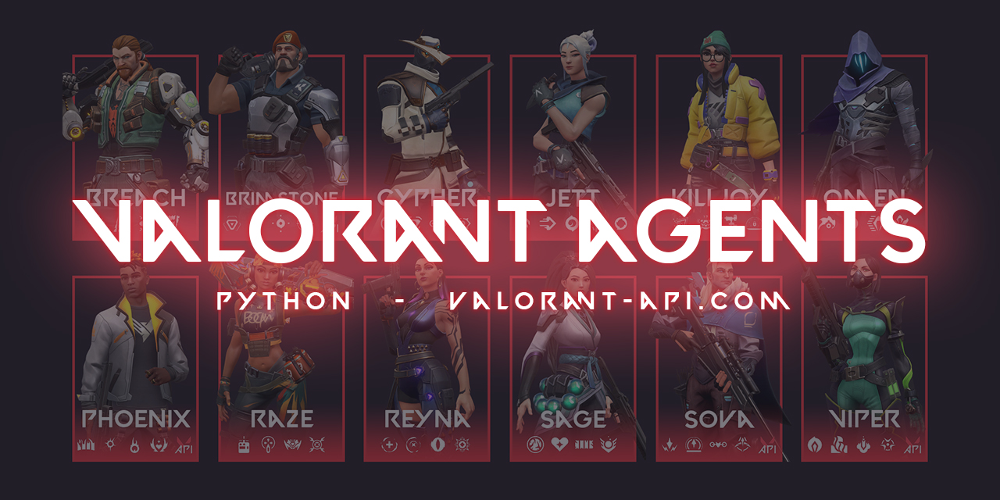

# Valorant Agents Image Generator

## How to use?

- JUST RUN IT! It has nothing special. if you ever worked with python, you only need to install PILL module,
  if you don't have it you can download it with:

      >>> pip3 install pillow

## Special thanks to:

- NotOfficer | **[Valorant-API](https://valorant-api.com/)** for their powerful API

- MyNameIsDark01 | **[Athena](https://github.com/MyNameIsDark01/Athena)** for his project, i copied some codes from that XD
